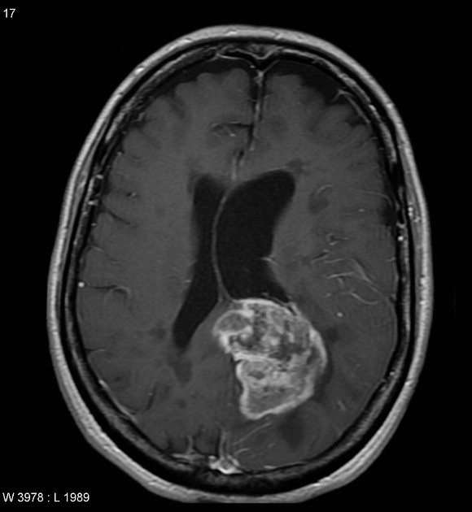
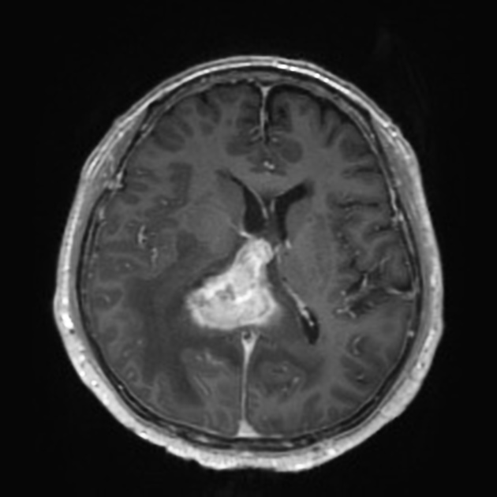

# Classification of Glioblastoma versus Primary Central Nervous System Lymphoma using Convolutional Neural Networks

```diff
! CAUTION: this tool is not a medical product and is only intended for research purposes. !
```

Glioblastoma       |  Primary central nervous system lymphoma
:-----------------:|:----------------------------------------:
  |  
Case courtesy of Assoc Prof Frank Gaillard, <a href="https://radiopaedia.org/">Radiopaedia.org</a>. From the case <a href="https://radiopaedia.org/cases/5565">rID: 5565</a>. | Case courtesy of Dr Bruno Di Muzio, <a href="https://radiopaedia.org/">Radiopaedia.org</a>. From the case <a href="https://radiopaedia.org/cases/64657">rID: 64657</a>.

# Inference example

```bash
$ python step2_predict.py \
    --model-weights checkpoints/efficientnetb4_aug_none/ckpt_137_0.0000.hdf5 \
    images/sample-*.jpeg
images/sample-gbm.jpeg                   100.00 % GBM
images/sample-pcnsl.jpeg                 100.00 % PCNSL
```

_Note: the saved models are not part of this repository. Please contact the authors for_
_access to the models._

# Steps to reproduce results

1. Set up Python environment. One can also use the Docker image
`tensorflow/tensorflow:2.5.0-gpu-jupyter`. That was used to for model training. If not
using a Docker image, we recommend creating a virtual environment or a conda environment
for this code.

    ```
    pip install --no-cache-dir \
        h5py \
        matplotlib \
        numpy \
        pandas \
        pillow \
        scikit-learn \
        tensorflow>=2.3.0
    ```

2. Organize data for GBM and PCNSL samples into the following directory structure. The
names of the image files can be arbitrary. The most important thing is to keep GBM
samples in `data/gbm/` and PCNSL samples in `data/pcnsl/`. Note that all of these
samples will be used for training and validation. A test set should be constructed with
images not in this `data` directory.

    ```
    data/
    ├── gbm
    │   ├── img0.jpg
    │   └── img1.jpg
    └── pcnsl
        ├── img0.jpg
        └── img1.jpg
    ```

3. Convert the image data to HDF5 format. Do this with the following command:

    ```bash
    python step0_convert_images_to_hdf5.py data/ data.h5
    ```

    This will create a file `data.h5` with the following datasets:

    ```
    /gbm/380_380/features
    /gbm/380_380/labels
    /pcnsl/380_380/features
    /pcnsl/380_380/labels
    ```

    The `380_380` indicates that the images were resized to 380x380 pixels. The labels
    of GBM are 0, and the labels of PCNSL are 1.

4. Train models. The commands below will save checkpoints to three different directories
(one for each model). The training differs by the type of augmentation applied to the
training images. The the `none` class, no augmentation is applied. In `base`, images
are randomly flipped, and their brightness and hue is randomly modified. In
`base_and_noise`, images are augmented in the same way as in `base` but Gaussian noise
is also applied to a small subset of images.

    ```bash
    python step1_train_model.py \
        --augmentation none \
        --epochs 300 \
        data.h5 \
        checkpoints/augmentation-none/
    ```

    ```bash
    python step1_train_model.py \
        --augmentation base \
        --epochs 300 \
        data.h5 \
        checkpoints/augmentation-base/
    ```

    ```bash
    python step1_train_model.py \
        --augmentation base_and_noise \
        --epochs 300 \
        data.h5 \
        checkpoints/augmentation-baseandnoise/
    ```

5. Run inference using the trained model. Prediction is reasonably quick and does not
require a GPU.

    ```bash
    python step2_predict.py \
        --model-weights checkpoints/model.hdf5 \
        images/*
    ```

    The output looks something like this:

    ```
    images/sample-gbm.jpeg                   100.00 % GBM
    images/sample-pcnsl.jpeg                 100.00 % PCNSL
    ```

    To save the prediction results to a CSV file, use the `--csv` option.

    ```bash
    python step2_predict.py \
        --csv predictions.csv \
        --model-weights checkpoints/model.hdf5 \
        images/*
    ```

    The CSV file looks something like this:

    ```
    path,prob_gbm,prob_pcnsl
    images/sample-gbm.jpeg,0.9999999402953463,5.970465366544886e-08
    images/sample-pcnsl.jpeg,4.3511390686035156e-05,0.999956488609314
    ```

6. Plot training metrics (loss and accuracy on training and validation sets). Use the
Jupyter notebook `step3_plot_training_metrics.ipynb` for this.

7. Calculate AUROC and plot ROC curves. Use the Jupyter notebook `step4_plot_roc.ipynb`
for this.

8. Plot Grad-CAM heatmaps overlaid on images.

    ```bash
    mkdir -p gradcam-outputs
    python step5_plot_grad_cam.py \
        --model-weights checkpoints/model.hdf5 \
        --output-dir gradcam-outputs \
        images/*
    ```

## In Docker or Singularity

These scripts and notebooks can all be run within the
[official TensorFlow Docker image](https://hub.docker.com/r/tensorflow/tensorflow)

```
tensorflow/tensorflow:2.5.0-gpu-jupyter
```

This Docker image can be used with Docker or Singularity.
